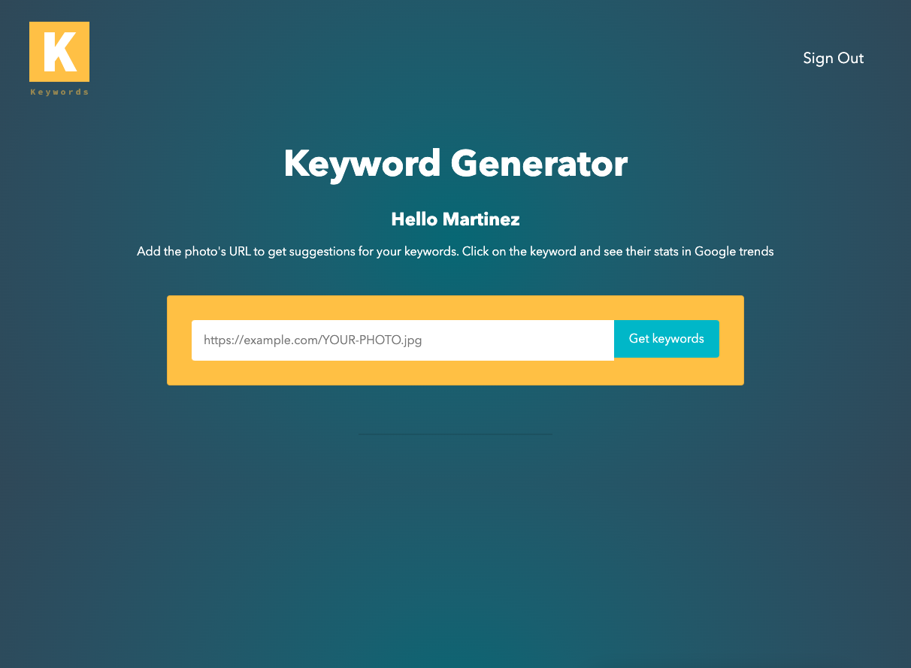
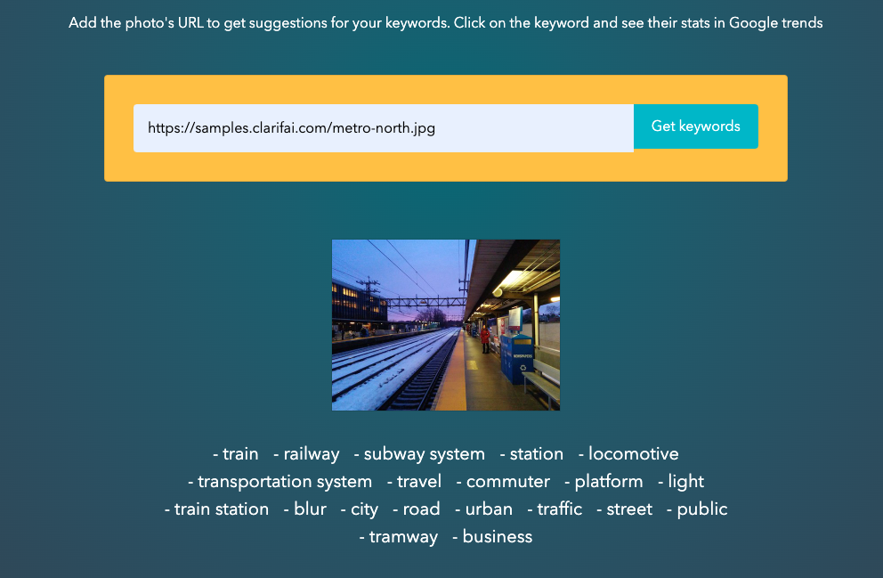

# Keyword Generator

This is a projects to help photographers to find keywords for their pictures.

## Table of contents

- [Overview](#overview)
  - [The challenge](#the-challenge)
  - [Links](#links)
- [My process](#my-process)
  - [Built with](#built-with)
  - [Useful resources](#useful-resources)
- [Author](#author)

## Overview

### The challenge

Users should be able to:

- View the optimal layout for the site depending on their device's screen size
- See hover states for all interactive elements on the page
- Register and sign.

### Links

- Solution URL: [Solution URL](https://github.com/vianydev/keyword-generator)
- Live Site URL: [Live site URL](https://vianydev.github.io/keyword-generator/)

## My process

### Built with

- Semantic HTML5 markup
- Flexbox
- [React](https://reactjs.org/) - JS library
- [Tachyons](https://tachyons.io/) - Css Components

### Useful resources

- [Clarifai](https://www.clarifai.com/) - This helped me to handle the keywords funtionality.
- [Knex](https://knexjs.org/) - Tool to handle postgresql querys
- [Bcrypt](https://www.npmjs.com/package/bcrypt-nodejs) - Tool to generate hashes for the passwords

## Author

- Twitter - [@vianydev](https://www.twitter.com/vianydev)
- Linkedin - [@vianydev](https://www.linkedin.com/in/vianydev/)
- Github - [@vianydev](https://github.com/vianydev)